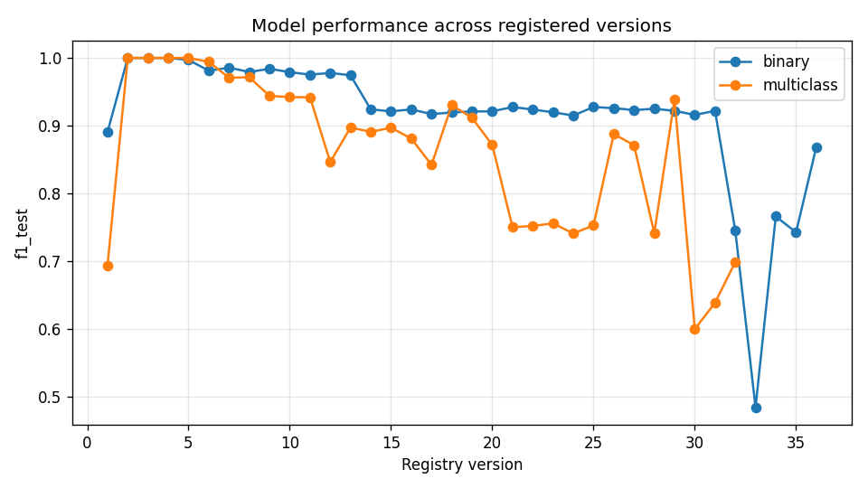

# Model Leaderboard

_Auto-generated by `scripts/generate_leaderboard.py` — last updated 2026-07-30T12:04:50Z UTC._

MLflow's own experiment-tracking UI on DagsHub is only visible to repository
contributors, regardless of whether this git repo is public (see the README's
MLflow section for why). This file mirrors the same underlying data — every
registered model version's test score and which one is currently live — so
anyone browsing this repo on GitHub can see it without a DagsHub account.

### Binary classifier (`predictive-maintenance-binary`)

| Version | Model family | f1_test | f1_train | Status |
|---------|--------------|---------|----------|--------|
| 36 | lightgbm | 0.8682 | 0.9945 | 🟢 @production |
| 35 | random_forest | 0.7423 | 0.9967 |  |
| 34 | lightgbm | 0.7658 | 0.8590 |  |
| 33 | logreg | 0.4837 | 0.5544 |  |
| 32 | xgboost | 0.7449 | 0.9931 |  |
| 31 | xgboost | 0.9219 | 0.9975 |  |
| 30 | xgboost | 0.9158 | 0.9973 |  |
| 29 | xgboost | 0.9219 | 0.9968 |  |
| 28 | xgboost | 0.9249 | 0.9970 |  |
| 27 | xgboost | 0.9230 | 0.9972 |  |
| 26 | xgboost | 0.9258 | 0.9978 |  |
| 25 | xgboost | 0.9275 | 0.9973 |  |
| 24 | xgboost | 0.9149 | 0.9971 |  |
| 23 | xgboost | 0.9197 | 0.9980 |  |
| 22 | xgboost | 0.9238 | 0.9969 |  |

_21 older version(s) omitted — showing the 15 most recent._

### Multiclass classifier (`predictive-maintenance-multiclass`)

| Version | Model family | f1_test | f1_train | Status |
|---------|--------------|---------|----------|--------|
| 32 | xgboost | 0.6984 | 1.0000 | 🟢 @production |
| 31 | xgboost | 0.6381 | 0.8063 |  |
| 30 | xgboost | 0.5994 | 0.9987 |  |
| 29 | xgboost | 0.9388 | 1.0000 |  |
| 28 | xgboost | 0.7410 | 1.0000 |  |
| 27 | xgboost | 0.8712 | 1.0000 |  |
| 26 | xgboost | 0.8875 | 1.0000 |  |
| 25 | xgboost | 0.7525 | 0.9714 |  |
| 24 | xgboost | 0.7406 | 1.0000 |  |
| 23 | xgboost | 0.7556 | 1.0000 |  |
| 22 | xgboost | 0.7517 | 1.0000 |  |
| 21 | xgboost | 0.7499 | 1.0000 |  |
| 20 | xgboost | 0.8716 | 1.0000 |  |
| 19 | xgboost | 0.9114 | 1.0000 |  |
| 18 | xgboost | 0.9304 | 1.0000 |  |

_17 older version(s) omitted — showing the 15 most recent._

## Promotion history

Most recent 0 promotion(s):

_No promotions recorded yet._

